# Setup Fedora virtual machine on VirtualBox

Table of Contents
------------------

- [Create a new VirtualBox VM](#create-a-new-virtualbox-vm)
- [Connecting to the VM](#connecting-to-the-vm)

Create a new VirtualBox VM
---------------------------
In the VirtualBox GUI click "New" and choose the following parameters in the wizard:

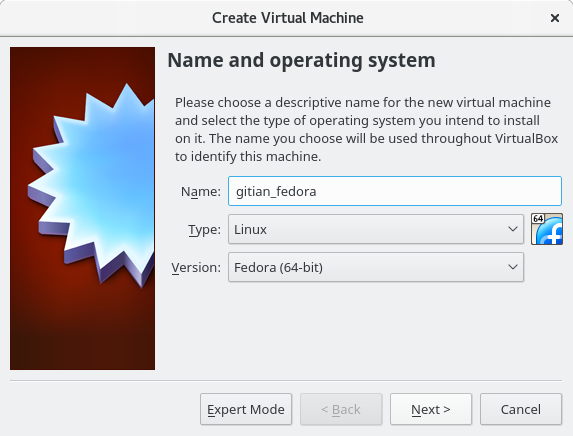

- Type: Linux, Fedora (64-bit)


- Memory Size: at least 3000MB, anything less and the build might not complete.

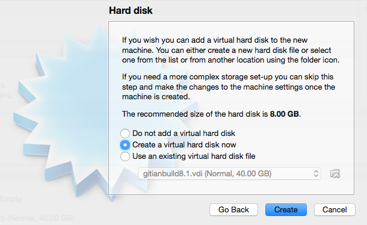

- Hard Disk: Create a virtual hard disk now

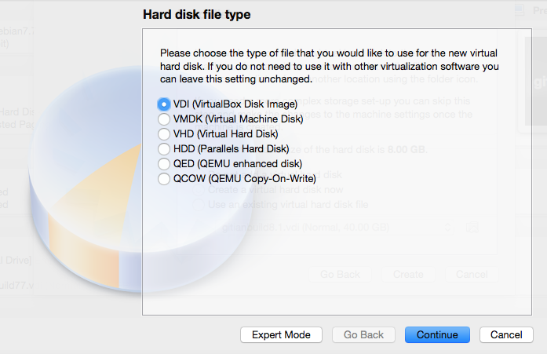

- Hard Disk file type: Use the default, VDI (VirtualBox Disk Image)

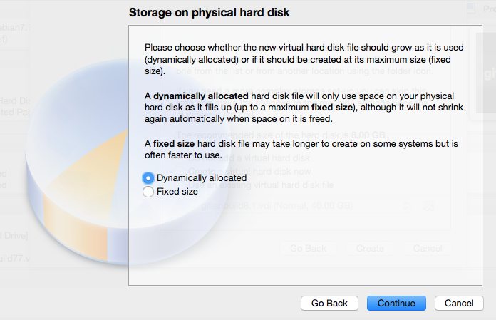

- Storage on physical hard disk: Dynamically Allocated

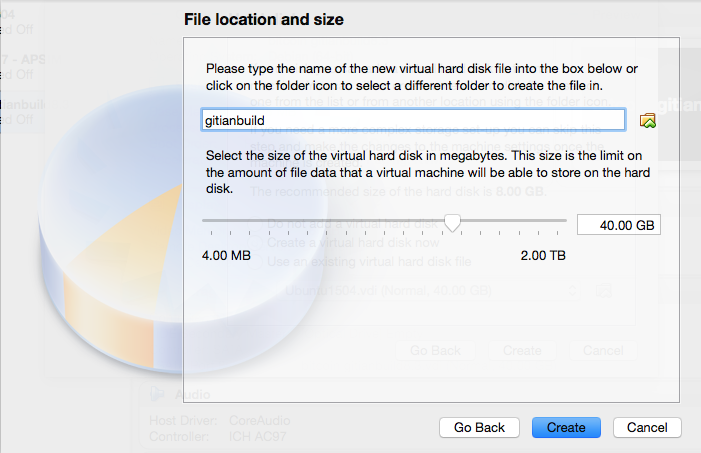

- File location and size: at least 40GB
- Click `Create`

After creating the VM, we need to configure it.

- Click the `Settings` button, then go to `System` tab and `Processor` sub-tab. Increase the number of processors to the number of cores on your machine if you want builds to be faster.

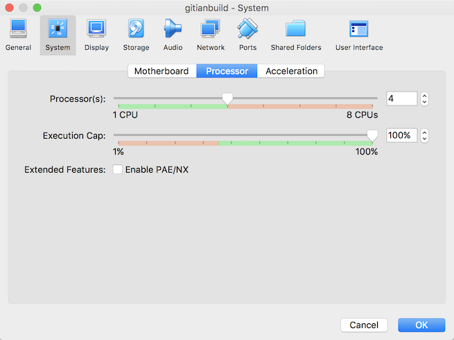

- Go to the `Network` tab. Adapter 1 should be attached to `NAT`.

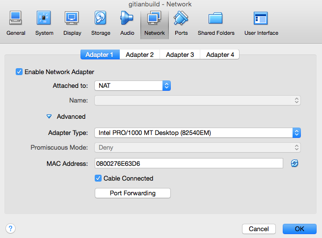

- Click `Advanced`, then `Port Forwarding`. We want to set up a port through which we can reach the VM to get files in and out.
- Create a new rule by clicking the plus icon.

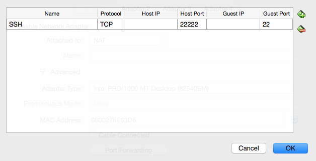

- Set up the new rule the following way:
  - Name: `SSH`
  - Protocol: `TCP`
  - Leave Host IP empty
  - Host Port: `22222`
  - Leave Guest IP empty
  - Guest Port: `22`

- Click `Ok` twice to save.

Get the [Fedora Netinstall Image](https://download.fedoraproject.org/pub/fedora/linux/releases/29/Workstation/x86_64/iso/Fedora-Workstation-netinst-x86_64-29-1.2.iso) (other resonably recent release should work as well, see [Fedora Workstation Download page](https://getfedora.org/en/workstation/download/)).
This DVD image can be [validated](https://getfedora.org/verify) using a SHA256 hashing tool, for example on
Unixy OSes by entering the following in a terminal:

    echo "6554404b66d38b89693232966d9290ed62156e32d1edde4074b1d25c97a7b10e  Fedora-Workstation-netinst-x86_64-29-1.2.iso" | sha256sum -c
    # (must return OK)

Replace `sha256sum` with `shasum` on OSX.

Then start the VM. On the first launch you will be asked for a CD or DVD image. Choose the downloaded ISO.

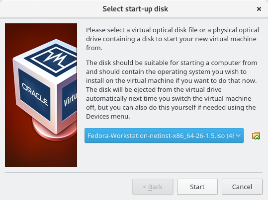

Installing Fedora
------------------

This section will explain how to install Fedora on the newly created VM.

- Choose the default option. This will start the graphical installer.

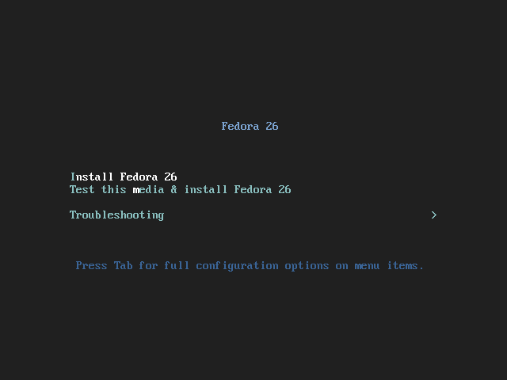

- Pick the language, locale and keyboard settings of your choice. You can just go with the defaults or select your own information.

- The VM will detect network settings using DHCP, this should all proceed automatically
- Afterward, the installer will automatically pick an appropriate *Installation Source* (closest mirror) and starts fetching the package metadata.
- Then, click the button for *Software Selection* and choose the *Minimal Install* from as the base environment and no addons for the selected environment. This will reduce installation time and disk usage.
- Finally, open the settings for *Installation Destination* and click *Done*. The default settings are just fine.

- The *Installation Summary* should look like this:

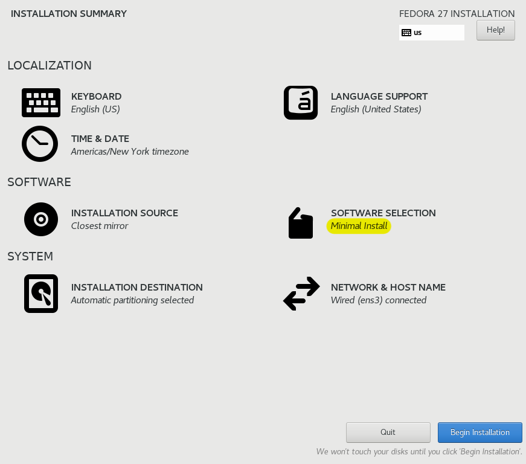

- Confirm by clicking on *Begin Installation*.
- You can leave the root password empty. Otherwise, enter it twice and remember it for later.
- Also, create a new user. Name the new user `gitianuser` (the full name doesn't matter, you can leave it empty)
- Select *Make this user administrator* to add them to the wheel group.
- Choose a user password and enter it twice (remember it for later)

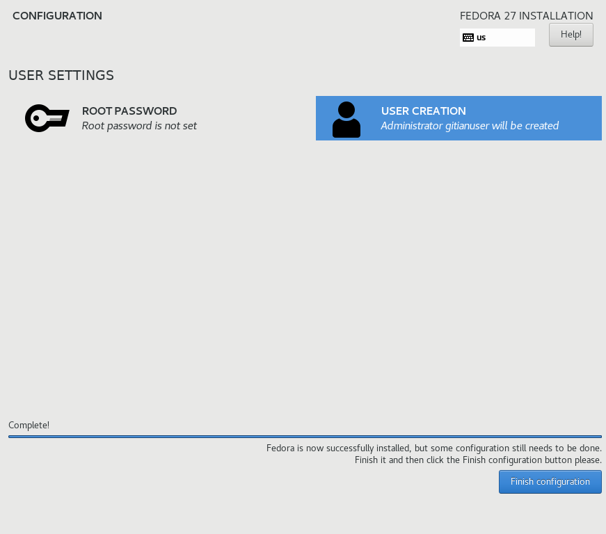

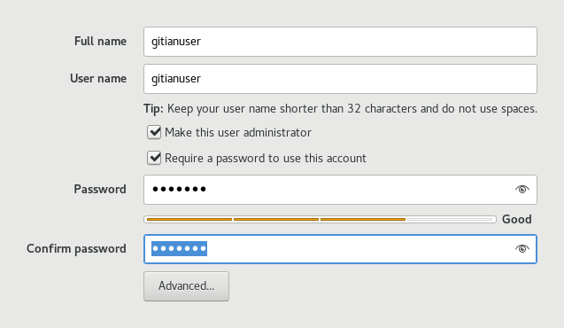

- Complete the installation by clicking *Finish configuration*. Then wait for it to complete and select *Reboot*.
- If the greeter asks you to install fedora, make sure to remove the ISO: In the running VirtualBox instance, select *Devices* > *Optical Drives* > *Remove disk from virtual drive*. Then reboot again.
- After reboot you will have a working Fedora VM. Congratulations!

You'll be presented with a screen similar to this.

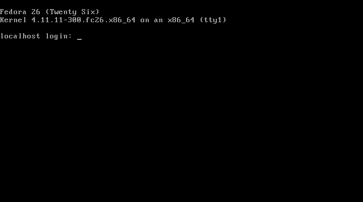

Connecting to the VM
----------------------

After the VM has booted you can connect to it using SSH, and files can be copied from and to the VM using a SFTP utility.
Connect to `localhost`, port `22222` (or the port configured when installing the VM).
On Windows you can use [putty](http://www.chiark.greenend.org.uk/~sgtatham/putty/download.html) and [WinSCP](http://winscp.net/eng/index.php).

For example, to connect as `gitianuser` from a Linux command prompt use

```
$ ssh gitianuser@localhost -p 22222
The authenticity of host '[localhost]:22222 ([127.0.0.1]:22222)' can't be established.
ECDSA key fingerprint is SHA256:Px5l4jnEItv44YnaESVlPMTu9gPYopIELKok99CjCvo.
Are you sure you want to continue connecting (yes/no)? yes
Warning: Permanently added '[localhost]:22222' (ECDSA) to the list of known hosts.
gitianuser@localhost's password: (enter gitianuser password configured during install)
[gitianuser@localhost ~]$
```

Use `sudo` to execute commands as root.
