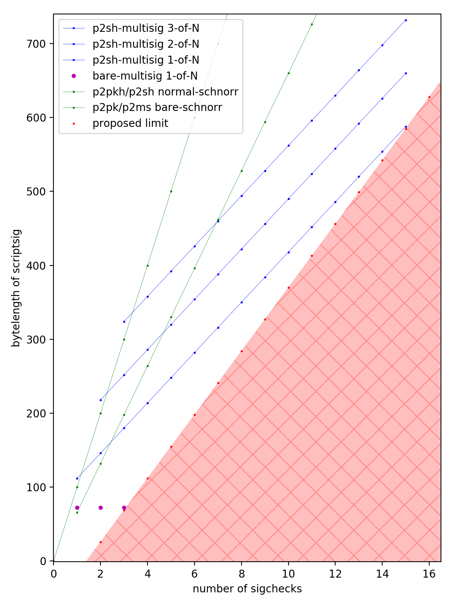
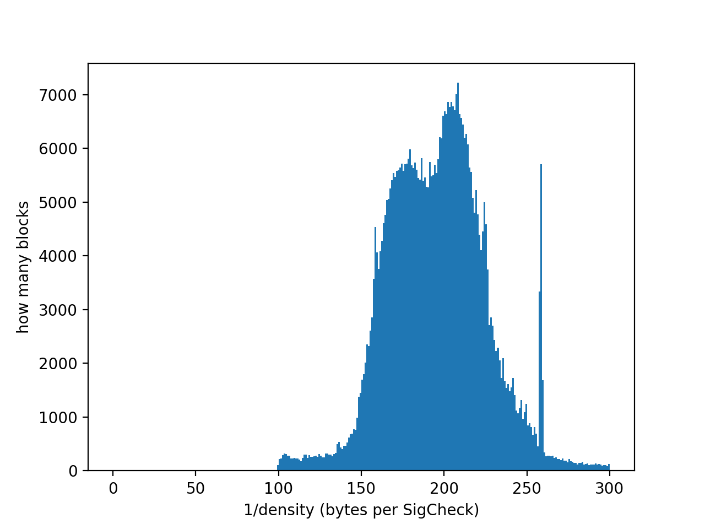

# Summary

Bitcoin Cash's SigOps counting and limiting system will be replaced with a new system, referred to as SigChecks.

# Motivation

Since early days, Bitcoin has had a SigOps counting rule for limiting the amount of CPU usage possible in a given transaction or block, based on the principle that signature verifications are by far the most CPU-intense operations.

Although partly effective, there are well known issues with sigops, which mainly stem from the fact that SigOps are judged by parsing scripts, rather than executing them.
Bitcoin splits scripts into two transactions (the scriptPubKey of the transaction that creates a coin, and the scriptSig of the transaction that spends it), yet the actual CPU work of verifying a transaction solely happens in the spending transaction, and this leads to some paradoxical situations: a transaction/block that contains high sigops might involve very little CPU work, and conversely a transaction with low sigops may require very high CPU work.

The essential idea of SigChecks is to perform counting solely in the spending transaction, and count actual executed signature check operations.

# Specification

## Counting rule

The SigChecks count for a given script is discovered during execution of the script.

- Executing OP_CHECKSIG / OP_CHECKSIGVERIFY / OP_CHECKDATASIG / OP_CHECKDATASIGVERIFY increments SigChecks by:
  - +0, if signature is NULL.
  - +1, if signature is non-NULL.
- Executing an M-of-N OP_CHECKMULTISIG / OP_CHECKMULTISIGVERIFY increments SigChecks by:
  - +0, if all M signatures are NULL.
  - +M, if at least one signature is non-NULL and the verification is in [New/Schnorr mode](2019-11-15-schnorrmultisig.md) (dummy element is non-NULL).
  - +N, if at least one signature is non-NULL and the verification is in Old/ECDSA mode (dummy element is NULL).

Here NULL means a script stack element that has length 0; passing NULL in place of an expected signature is the canonical way of cancelling the signature check, i.e., making the signature checking opcode fail / return false (and the only way permitted way to cause this result ever since NULLFAIL rule activated).

## Per-block limitation (consensus rule)

After activation, any block where the total number of SigChecks accumulated (during all script executions - scriptSig, scriptPubKey, and P2SH redeemScript - in all inputs excepting coinbase) violates the following limit based on the maximum block size shall be rejected:

    block_SigChecks <= max_Blocksize // 141

Here, max_Blocksize refers to the consensus limit that is enforced on the full serialized block size (including block header, transaction counter, and all serialized transaction).

Currently, `max_BlockSize` = 32000000 so the maximum allowed `block_SigChecks` would be 226950 for all blocks. However, in future block size increases, it should be assumed that the SigChecks limit increases proportionally.

## Per-transaction limits (consensus rule)

After activation, any transaction where the total number of SigChecks accumulated (during all script executions - scriptSig, scriptPubKey, and P2SH redeemScript - in all inputs excepting coinbase) violates the following limit shall be rejected:

    transaction_SigChecks <= 3000

## Per-input limitation (standardness rule)

For a given transaction input, the number of SigChecks accumulated during all script execution (scriptSig, scriptPubKey, and P2SH redeemScript) is to be limited according to the byte-length of the scriptSig, `len_scriptSig`:

    txin_SigChecks <= (len_scriptSig + 60) // 43,   where // indicates floor division.
      - or equivalently -
    len_scriptSig >= 43 * txin_SigChecks - 60

Any transaction that contains an input violating this limit should be rejected from nodes' mempools and not relayed. However, blocks may contain inputs that violate this limit.

This is only a non-consensus standardness (transaction relay) rule, meaning that transactions within blocks do not need to obey this rule. Nodes should only enforce this rule starting at the activation time, and if any transactions in mempool violate this rule at precisely the time of activation, they should be ejected.

## Removal of SigOps

After the activation, nodes shall disable the all consensus rules and all standardness rules relating to the old SigOps counting mechanism. There are four such rules:

- The consensus limit of 20000 sigops per MB of block shall be disabled.
- The consensus limit of 20000 sigops per transaction shall be disabled.
- The standardness limit of 4000 sigops per transaction shall be disabled.
- The standardness limit of 15 sigops per P2SH input shall be disabled.

## Notes

- The question of whether all signatures are null is not precisely the inverse of whether the opcode returns true/false to stack: consider the case of 0-of-N OP_CHECKMULTISIG, which always returns true, yet also has "all null" signatures. Also, historically pre-NULLFAIL opcodes would return false for non-null invalid signatures, instead of failing.

# Rationale and commentary on design decisions

## Counting rule

The proposed counting rule is easy to implement, but it's not the simplest / most obvious approach. There is one primary design feature we wanted to ensure: *The proposed counting rule means that the sigchecks count can be evaluated by executing a script with a 'dummy'/deferred signature verifier, i.e., without performing any CPU-intensive elliptic curve math.*

We currently have the NULLFAIL rule, which means that signature check opcodes will either:
- fail with error, because the non-null signatures were not valid, or there was a mixture of null / non-null signatures, or because the checked public keys were incorrectly encoded, or some other reason.
- return true, if all signatures are non-null and valid, or,
- return false, if all signatures are null and there is at least 1 signature.

Right now, nodes can optionally use this fact to defer public key and signature checks until after script execution, simply placing true/false on stack depending on whether the signatures are null or not, and continuing execution as if the checks were done.
Later, after the script has finished executing successfully, the deferred checks can be finally executed to determine whether the script should in fact be failed entirely.
This deferment allows some efficiency advantages (like allowing Schnorr batch validation, fast rejection of some invalid blocks/transactions, etc.).

The simplest imaginable rule would be to only count signature check function calls that are actually done.
The main problem with this approach is that M-of-N ECDSA multisig verifications perform a variable number of signature checks, at least M but as many as N.
Some of these checks fail, some succeed. The count would then be only determinable by actually performing full signature checks.
With the deferment mentioned above, this would mean that any limits on sigchecks could not be accurately enforced before actually carrying out the signature checks.

A secondary aspect of counting is that when all signatures are null, we assign a sigchecks count of 0.
This is a rare case since most scripts want only valid signatures anyway.
However, it does increase accuracy of the count, and it can be useful in smart contracting to use null signatures instead of booleans to control branching flows (booleans pushed from scriptSig can be malleated).
Since it is easy to implement the 0 sigchecks counting and it's more accurate that way, we decided to include this.

## Why have limits?

The SigOps and SigChecks limits exist solely to limit the impact of denial of service attacks. There are a variety of attacks that might occur, but these are the main ones:
- An attacking miner can craft valid/invalid blocks packed full with valid and CPU-intensive non-standard scripts that would require huge amounts of time (perhaps hours) to validate.
- Anyone may flood the mempool with valid but CPU-intensive transactions. Since these are valid, they will be propagated to all nodes 'for free' and load down the network.

While these might sound bad, it's worth noting that the disruption would be temporary.
The mempool and block attack vectors are essentially decoupled since efficient nodes use transaction validity caching: if they have accepted a transaction already, they don't need to re-verify it when they see it mined in a block.
Also, CPU-intensive blocks do not cause any kind of "permanent damage" to new nodes coming online, since again efficient nodes typically provide for an 'assume-valid' setting that only requires fully verifying recent blocks.

*Blocks*:
Slow blocks can be made without any setup, but the slowest possible block would require a many setup blocks to be mined beforehand that generate attack outputs.
These attack outputs would then all be spent in the attack block.
Since scripts are limited to 201 opcodes and inputs are at least 41 bytes, this could achieve about 5 signature checks for every byte in the spending block, or 160 million signature checks with today's maximum block size.
As a rough rule of thumb, each signature check takes 50 microseconds, so such a block would take a couple of CPU-hours to validate (though this is trivially parallelized).
The proposed limit of 141 bytes / sigcheck cuts the worst case down by a factor of 700.
The main motivation here isn't just to ensure nondisruption with current block sizes, but also to make sure future block size increases can be made with needing to worry so much about slow block attacks.

*Mempool*:
As far as mempool attacks go, these currently are already greatly limited by standardness rules on mainnet that 1) whitelist only certain allowed output script templates and 2) limit P2SH to 15 sigops.
If either rule were simply removed, it would permit abusive scripts that perform a large number of verifications in a tight space.
Since we are planning to remove sigops, then something needs to go in place of that P2SH sigops rule.
Besides limiting the density of CPU usage, it also makes sense to limit signature checks density in transactions as a *support* for the block limit: we don't want that the mempool can be totally filled with high-sigchecks transactions that take ages to clear out (since each block can only consume so many of them).

It's worth pointing out some of the indirect limits that are created as a result:
- As mentioned above it is impossible for the number of SigChecks in an input to exceed 201, which is the current limit on the 'opcode count' for a single script.
  - However, a mainnet standard transaction cannot have a scriptSig longer than 1650 bytes, which means an input in a standard transaction won't be able to have more than 39 SigChecks.
- The per-input rule means that the overall density of SigChecks in a standard transaction cannot exceed 33.5 bytes / SigCheck. This occurs with many inputs having each two SigChecks in a scriptSig of length 26, i.e., an input of size 26+41 = 67 bytes.
  - Due to additional script template standardness rules on mainnet, it is practically not possible to produce such a short scriptSig containing two sigchecks. So, practically one can only achieve 36.67 bytes/SigCheck (three SigChecks in a scriptSig of length 69), using 1-of-3 bare multisignatures or some P2SH tricks.
- Likewise standard transactions on mainnet are limited to 100000 bytes, so a standard transaction won't be able to have more than 3000 sigchecks.

## Choice of numbers

The numbers proposed for the per-input and per-block limits are based on an examination of current typical uses, and an examination of the historical blockchain.

The per-input limit is designed to support the two most extreme standard use cases, which deserve continuing support and (though rare) are still used occasionally:

* Spending a bare 1-of-3 multisignature in ECDSA mode will have 3 SigChecks in around 73 bytes. (Bare multisigs like 1-of-4 and beyond are nonstandard to fund.)
* Spending a P2SH 1-of-15 multisignature in ECDSA mode will have 15 SigChecks in around 589 bytes.

The proposed per-input rule is a line interpolating between those two cases, with a spare allowance of 4 bytes for each (since ECDSA signatures are variable size, and very rarely are they shorter than this in normal usage).

Typical use cases are much much lower density than these. P2PK and P2PKH have 1 SigCheck in ~70 bytes and ~105 bytes respectively, and most P2SH multisignatures are 2-of-3 spent with ECDSA which have 3 SigChecks in a ~250 byte scriptSig. I've plotted the common standard use cases below. As can be seen

The block limit is based on an examination of normal usage patterns and observations on historical blocks. Historically, the bulk (75%) of blocks have had a density of between 150 and 250 bytes/SigCheck, and the average density of the whole chain is 176 bytes/SigCheck. Only 2% of blocks have been more dense than 141 bytes/SigCheck. This matches the fact that the vast majority of inputs/outputs are P2PKH, which on the whole (considering funding and spending) have a density of around 182 bytes/SigCheck. Rarely, one sees a block that is packed full of an unusually high fraction of P2SH 2-of-3 multisignature consolidations, which pushes down to the 100 bytes/SigCheck level. Blocks more dense than 98 bytes/SigCheck have been extremely rare, making up 0.01% of blocks.

The exact number of 141 bytes/SigCheck comes from considering a fairly common use case, which is consolidating many P2PKH inputs. If done with Schnorr signatures then each input is 141 bytes and one SigCheck.

The choice of 141 bytes/SigCheck for a block is ~4x times more aggressive than the ~36.67 bytes/SigCheck standardness rule. It's worth emphasizing however that this block limit is based on the maximum block size. Thus, it may happen that a normally mined block has an actual density of ~36.67 bytes/SigCheck, however, such a block could not be more than ~1/4th of the maximum block byte size.

A histogram of historical block densities is plotted below:

# Implementation

**Implementation information to be added - TBD**

# Acknowledgements

Thanks to Amaury Sechet, Josh Green, Tobias Ruck, Tyler Smith, Calin Culianu, and Andrew Stone for valuable feedback.
